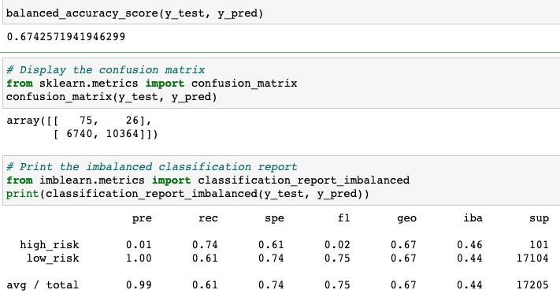
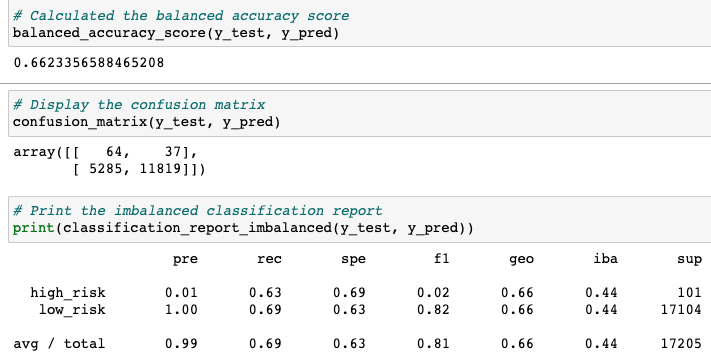
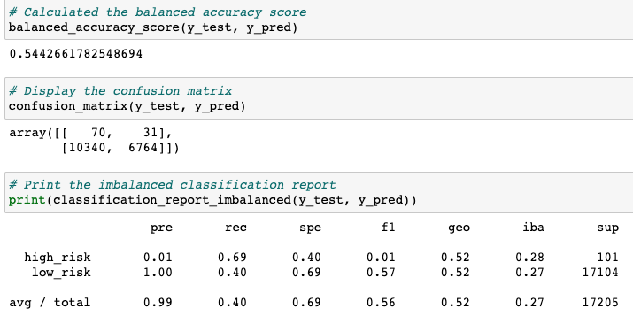
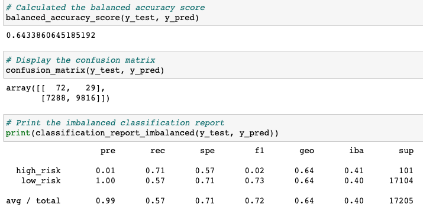
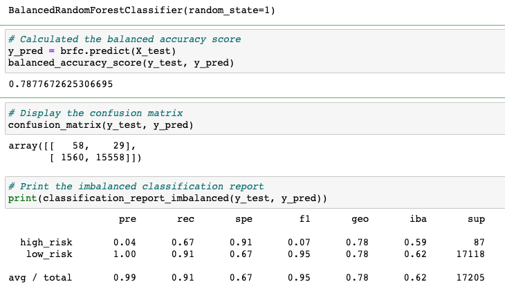
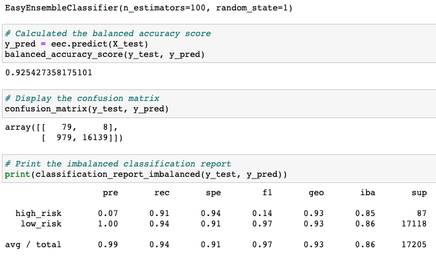

# Credit_Risk_Analysis

# Project Overview 
- In this project, we are using machine learning to analyze credit risk for a specific group of samples. This group of samples is split into training and testing groups. We use sklearn and imblearn to build different models to train the training samples and use that results to evaluate the credit risk of test samples. We used the following algorithm.

- Naive Random Oversampling
- SMOTE Oversampling
- Cluster Centroids Undersampling
- Combination Sampling (SMOTEENN)
- Balanced Random Forest Classifier
- Easy Ensemble AdaBoost Classifier

## Results: 

### Naive Random Oversampling

1. Balanced Accuracy: 0.6742571941946299
2. Precision High_risk/low_risk: 0.01/1.00
3. Recall Average: 0.61

### SMOTE Oversampling

1. Balanced Accuracy: 0.6623356588465208
2. Precision High_risk/low_risk: 0.01/1.00
3. Recall Average: 0.69

### Cluster Centroids Undersampling

1. Balanced Accuracy: 0.5442661782548694
2. Precision High_risk/low_risk: 0.01/1.00
3. Recall Average: 0.40

### Combination Sampling

1. Balanced Accuracy: 0.6433860645185192
2. Precision High_risk/low_risk:  0.01/1.00
3. Recall Average: 0.57

### Balanced Random Forest Classifier

1. Balanced Accuracy: 0.7877672625306695
2. Precision High_risk/low_risk: 0.04/1.00
3. Recall Average: 0.91

### Easy Ensemble AdaBoost Classifier

1. Balanced Accuracy: 0.925427358175101
2. Precision High_risk/low_risk: 0.07/1.00
3. Recall Average:0.94

## Summary: 
- Based on the results of the first four resampling machine learning models, we can see that the precision rate is the same. The SMOTE oversampling performs slightly better while Cluster Centroids Undersampling provides a lower accuracy than other models. But overall, these four models have close results.

- However, the result is significantly better when we use ensemble classifiers. The balanced accuracy increases from around 60% to 92%, and the average recall is also higher, at 0.94. Therefore, we recommend using the ensemble classifier models for credit risk prediction and analysis.
